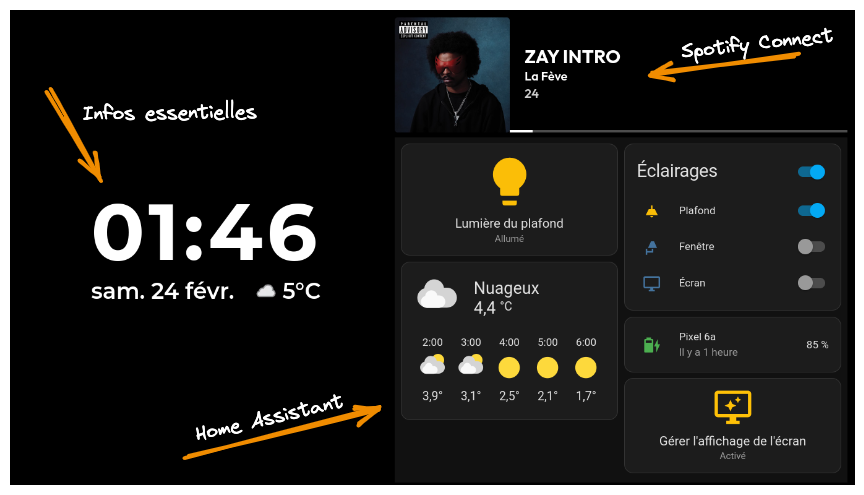

# InfoScreen

> Un écran d'informations intelligent, optimisé pour une utilisation au tactile, et prêt à intégrer une multitude d'outils.




## Pourquoi faire ?

Ce projet a pour but d'afficher de multiples informations sur un écran tactile qui est constamment allumé. Il permet par exemple de gérer sa domotique ou de recevoir des notifications de certains services, pour être au courant qu'un cours s'apprête à commencer via Pronote par exemple.


## Intégrations et fonctionnalités

* Notification "Heure du BeReal" ([@oriionn](https://github.com/oriionn))
* Pronote ([Papillon API](https://github.com/PapillonApp))
* Spotify ([NowPlaying](https://github.com/busybox11/NowPlaying-for-Spotify))
* Étendre un écran de PC ([Deskreen](https://github.com/pavlobu/deskreen))
* [Home Assistant](https://www.home-assistant.io/)
* Météo ([WeatherAPI](https://weatherapi.com))
* Affichage de la batterie du PC sous Linux quand elle est faible
* Changement de la luminosité en fonction de l'éclairage via la webcam
* Personnalisation via une API ouverte


## Installation

> Certaines fonctionnalités peuvent ne pas fonctionner sous Windows ou macOS. Testé avec Debian 12.  
> L'installation nécessite Git, NodeJS (version récente), NPM et PM2.

```
git clone https://github.com/johan-perso/infoscreen
cd infoscreen
npm install

pm2 start "npm run start" --name InfoScreen

# Pour la première utilisation de PM2, exécuter également ces commandes
pm2 startup
pm2 save
```


## Configuration

### Fichier .env

Renommer le fichier `.env.example` en `.env` et modifier les valeurs présentes. Certaines fonctionnalités seront désactivées si aucune valeur ne leur est définie.

### Changement automatique de la luminosité

Dépendances :

- Commande `brightnessctl` installée
- Paquet `fswebcam` sous Linux, `imagesnap` sous macOS

Configurer la variable d'environnement `VIDEO_DEVICE` par le chemin de votre webcam et `SCREEN_DEVICE` par le nom de votre écran :

- Pour obtenir le nom de votre webcam, vous pouvez utiliser la commande `v4l2-ctl --list-devices`.
- Pour obtenir le nom de votre écran, vous pouvez utiliser la commande `brightnessctl -l`. Vous pouvez tester un changement avec `brightnessctl -d "le nom de votre écran" set 50%`

### Surveillance via la webcam

> Lorsque la surveillance est activée, la luminosité automatique renverra une erreur fréquemment dans la console et ne pourra pas fonctionner correctement.

1. Télécharger l'archive la plus récente de cam2ip via leur [GitHub](https://github.com/gen2brain/cam2ip/releases/tag/1.6)
2. Extraire l'exécutable `cam2ip` présent dans l'archive dans un dossier de votre choix.
3. Configurer la commande à utiliser pour ouvrir un flux vidéo via le fichier .env : `CAMERA_COMMAND="/home/your_username/cam2ip/cam2ip -htpasswd-file /home/your_username/cam2ip/htpasswd -index 0"`

> Le fichier htpasswd est facultatif mais permet une authentification lors de la connexion au flux vidéo.  
> Pour connecter Home Assistant à votre flux vidéo, ouvrez les réglages et ajoutez une nouvelle intégration "MJPEG IP Camera"

### Emploi du temps via Pronote

Cette fonctionnalité permet de vous envoyer des notifications une heure avant le début de chaque cours, mais aussi d'afficher une barre de progression sur l'écran vous permettant d'estimer le temps avant que le cours commence.

L'emploi du temps est obtenu chaque nuit à quatre heures du matin et ne prendra pas en compte les modifications effectuées pendant la journée.

À l'heure actuel, le serveur d'API Papillon n'est plus disponible, vous pouvez utiliser l'URL `https://papillon-api.johanstick.fr` en attendant une prochaine mise à jour d'InfoScreen.

La variable `PRONOTE_CAS` vous permet de vous connecter à Pronote via un CAS, laissez vide ou entrer une valeur à partir de [cette liste](https://github.com/bain3/pronotepy/blob/master/pronotepy/ent/ent.py).


## API

InfoScreen ouvre un serveur WEB avec une API sur le port `3000` (modifiable avec la variable d'env `PORT`), celui-ci vous permet d'effectuer diverses actions sur votre écran afin d'étendre ses fonctionnalités et intégrations.

### Exemples d'intégration

- Vous pouvez créer des automatisations sur Home Assistant :
  - Activation/désactivation de la webcam
  - Activation/désactivation de l'écran
  - Mettre à jour la luminosité dès qu'une lumière change d'état
- Vous pouvez créer des raccourcis (avec Raccourcis sur iOS ou Automate sur Android) :
  - Allumer/éteindre l'écran lorsque vous vous en éloignez/rapprochez
  - Afficher les SMS d'authentifications à deux facteurs
  - Vous informez du niveau de batterie de votre téléphone
  - Vous prévenir lors d'un appel entrant ou du déclenchement d'une alarme
- Vous pouvez développer un robot Telegram pour :
  - Afficher ou enlever une page web sur l'écran, pour étendre un moniteur avec Deskreen par exemple

### Liste des endpoints

#### GET `/change`

> Active ou désactive la vérification automatique de la luminosité via la webcam

Query :
- `state` : boolean

#### GET `/camera`

> Change l'état de la surveillance via la webcam, peut provoquer des problèmes avec la détection de la luminosité

Query :
- `state` : boolean

#### GET `/recheck`

> Revérifie la luminosité via la webcam si la vérification automatique est active

#### POST `/pcmonitor`

> Affiche une page web en plein écran, les URLs Deskreen seront automatiquement améliorées pour une meilleure intégration

Body :
- `url` : string, ou rien pour fermer la page

#### POST `/notification`

> Envoie une notification personnalisée sur l'écran

Body :
- `title` : string
- `content` : string
- `iconPath` : string
- `timeout` : int


## Problèmes rencontrés

> Si le problème que vous rencontrez n'est pas listé ici, ouvrez une issue sur ce dépôt ou [contactez moi](https://johanstick.fr/contact).

#### `Missing X server or $DISPLAY` / `The platform failed to initialize.`

Exécuter la commande `sudo xhost +` pour permettre l'ouverture d'une fenêtre sur votre écran. Dans certaines configurations, vous devrez peut-être exécuter la commande depuis l'appareil lui-même et non via SSH.

#### `Impossible d'obtenir le niveau de batterie`

Pour permettre à InfoScreen d'obtenir le niveau de la batterie de votre appareil, assurez-vous d'avoir installé le paquet "upower" sous Debian (ou autres distributions basées).


## Licence

MIT © [Johan](https://johanstick.fr). Soutenez ce projet via [Ko-Fi](https://ko-fi.com/johan_stickman) ou [PayPal](https://paypal.me/moipastoii) si vous souhaitez m'aider 💙
